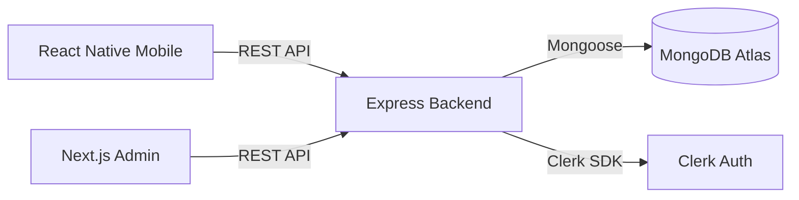

# 🎬 CinePal - Premier Movie Booking Experience

CinePal is a state-of-the-art, full-stack movie ticket booking application built with the MERN stack. It features a **React Native Android client**, a **Next.js 14 Admin Dashboard**, and a robust **Express + MongoDB backend**. 

Authentication and user management are seamlessly handled by **Clerk**, providing a secure and scalable foundation for both mobile and web platforms.


---

## 📑 Table of Contents

- [✨ Features](#-features)
- [💻 Tech Stack](#-tech-stack)
- [🏗 Architecture](#-architecture)
- [👥 Core Modules & Ownership](#-core-modules--ownership)
- [🚀 Getting Started](#-getting-started)
- [🔧 Configuration](#-configuration)
- [📖 API Documentation](#-api-documentation)
- [📂 Project Structure](#-project-structure)
- [🚢 Deployment](#-deployment)

---

## ✨ Features

### 📱 User App (Android)
- **Fluid Browsing**: Discover movies in *Now Showing* and *Coming Soon* categories.
- **Smart Search**: Search by movie title or theatre location.
- **Interactive Bookings**: Real-time seat selection with live availability status.
- **Session-Based Reservation**: Atomic seat holds with 10-minute expiry to ensure fair booking.
- **Digital Tickets**: Secure checkout with e-ticket generation and booking history.

### 🛠 Admin Dashboard (Web)
- **Catalogue Management**: Full CRUD operations for movies, including poster uploads to Cloudinary.
- **Infrastructure Setup**: Manage theatres and halls with customisable seat layouts.
- **Showtime Scheduling**: Powerful scheduler for single dates or recurring ranges.
- **Financial Oversight**: View all payments and process refunds for cancelled shows.


---

## 💻 Tech Stack

| Layer                | Technology                                                    |
| -------------------- | ------------------------------------------------------------- |
| **Backend**          | Node.js, Express, Mongoose, Clerk v3 SDK                      |
| **Database**         | MongoDB Atlas (Cloud)                                         |
| **Mobile App**       | React Native (Expo), React Navigation                         |
| **Mobile UI**        | React Native Paper (Material Design)                          |
| **Admin Dashboard**  | Next.js 14 (App Router), Tailwind CSS, shadcn/ui              |
| **Authentication**   | Clerk (Multi-platform JWT validation, Role-based access)      |
| **Asset Storage**    | Cloudinary (Posters & Branding)                               |

---

## 🏗 Architecture

CinePal uses a modular architecture where the Express backend serves as a single source of truth for both the mobile and web clients.



---

## 👥 Core Modules & Ownership

| Module                                | Primary Owner | Description                                      |
| ------------------------------------- | ------------- | ------------------------------------------------ |
| **1. Movie Catalogue**                | Member 1      | Admin CRUD + Public listing & search             |
| **2. Theatre & Halls**                | Member 2      | Physical infrastructure & seat layout generation |
| **3. Showtimes**                      | Member 3      | Scheduling logic & populated lookups             |
| **4. Seat Booking**                   | Member 4      | Atomic seat holds & status transitions           |
| **5. Payments & Tickets**             | Member 5      | Transaction logs, Ticket generation & booking confirmation |
| **6. History, Cancellations & Refunds** | Member 6      | User history & 24h refund policy enforcement     |

---

## 🚀 Getting Started

CinePal uses `pnpm` for efficient dependency management.

### 1. Clone & Install

```bash
git clone https://github.com/KavinduNirmal/cinepal.git
cd cinepal

# Install all workspace dependencies
pnpm install
```

### 2. Environment Setup

#### Backend (`server/.env`)
```env
PORT=8080
MONGODB_URI=your_mongodb_uri
CLERK_SECRET_KEY=sk_test_...
CLOUDINARY_CLOUD_NAME=...
CLOUDINARY_API_KEY=...
CLOUDINARY_API_SECRET=...
TMDB_API_KEY=... # Optional: for actor search
```

#### Mobile (`mobile/.env`)
```env
EXPO_PUBLIC_CLERK_PUBLISHABLE_KEY=pk_test_...
EXPO_PUBLIC_API_URL=http://<YOUR_LOCAL_IP>:8080/api
```

#### Admin (`admin/.env.local`)
```env
NEXT_PUBLIC_CLERK_PUBLISHABLE_KEY=pk_test_...
CLERK_SECRET_KEY=sk_test_...
NEXT_PUBLIC_API_URL=http://localhost:8080/api
```

---

## 📖 API Documentation

CinePal provides a detailed OpenAPI specification to ensure a clear contract between the frontend and backend.

- **OpenAPI Spec**: [docs/openapi.yaml](docs/openapi.yaml)
- **Visualizer**: You can paste the contents of `openapi.yaml` into [Swagger Editor](https://editor.swagger.io/) or use the VS Code OpenAPI extension.

| Endpoint Group | Description | Access |
| -------------- | ----------- | ------ |
| `/api/movies` | Catalogue management | Public (Read) / Admin (Write) |
| `/api/showtimes`| Scheduling and availability | Public (Read) / Admin (Write) |
| `/api/bookings` | Seat reservations | Authenticated User |
| `/api/payments` | Checkout and receipts | Authenticated User |

---

## 📂 Project Structure

```text
cinepal/
├── admin/       # Next.js 14 Admin Dashboard
├── mobile/      # React Native Mobile Application
├── server/      # Express API Backend
│   ├── models/  # Mongoose Schemas
│   ├── routes/  # Module-specific API Handlers
│   └── middleware/ # Auth & Validation
└── docs/        # API Documentation & Specs
```

---

## 🚢 Deployment

- **Backend**: Railway (Node.js runtime)
- **Admin**: Vercel (Next.js preset)
- **Mobile**: EAS Build (Android APK)

---
