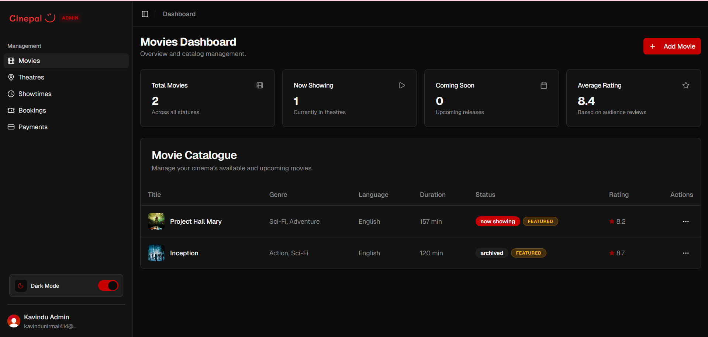

# CinePal Documentation

Welcome to the official technical documentation for CinePal. This directory contains comprehensive details about the project's vision, architecture, and implementation details.

## 📚 Documentation Index

1.  **[Problem Statement](./problem_statement.md)**
    - Overview of the challenges CinePal addresses and the proposed solution.
2.  **[System Architecture](./architecture.md)**
    - High-level design, component breakdown, and technology stack overview.
3.  **[Database Schema](./database_schema.md)**
    - Entity Relationship Diagram (ERD) and detailed Mongoose model descriptions.
4.  **[API Endpoint Reference](./api_endpoints.md)**
    - Categorized table of all RESTful endpoints and access levels.
5.  **[Team Responsibilities](./team_responsibilities.md)**
    - Module ownership and core responsibilities for each team member.

## 🛠 Developer Resources
- **OpenAPI Specification**: [openapi.yaml](./openapi.yaml)
- **Admin Dashboard Mockup**: 
