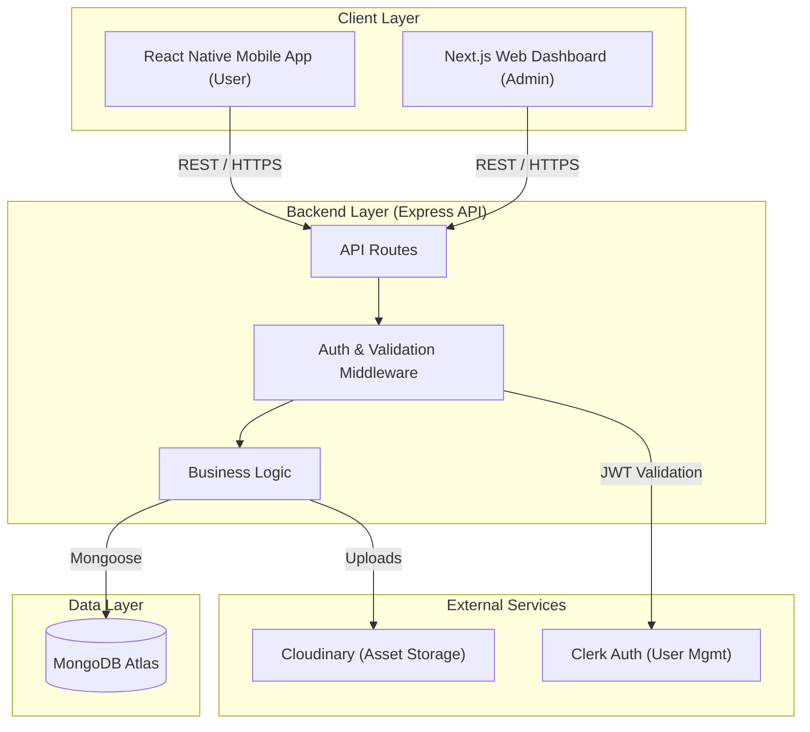

# System Architecture

CinePal follows a modern, decoupled architecture with a centralized backend serving multiple frontends.

## High-Level Architecture Diagram

## Component Breakdown

### 1. React Native Mobile App
- **Role**: Primary interface for end-users.
- **Tech**: React Native, Expo, React Navigation, React Native Paper.
- **Functions**: Movie discovery, cinema details & theatre-specific discovery, real-time seat selection, ticket booking, booking history.

### 2. Next.js Admin Dashboard
- **Role**: Internal tool for theatre administrators.
- **Tech**: Next.js 14 (App Router), Tailwind CSS, Shadcn UI.
- **Functions**: CRUD movies, manage theatre infrastructure (halls/seats), schedule showtimes, monitor payments.

### 3. Express Backend API
- **Role**: The "Brain" of the system.
- **Tech**: Node.js, Express, Mongoose.
- **Functions**: API endpoints, database interactions, authentication enforcement via Clerk, booking expiration logic.

### 4. MongoDB Atlas
- **Role**: Primary data store.
- **Tech**: NoSQL Document Database.
- **Features**: TTL indexes for automatic seat release, Geospatial indexes for theatre location search (future).

### 5. Clerk Authentication
- **Role**: Unified identity provider.
- **Features**: Multi-platform JWT validation, role-based access control (Admin vs. User).

### 6. Cloudinary
- **Role**: Cloud-based media management.
- **Functions**: Hosting movie posters, theatre images, and other visual assets.
