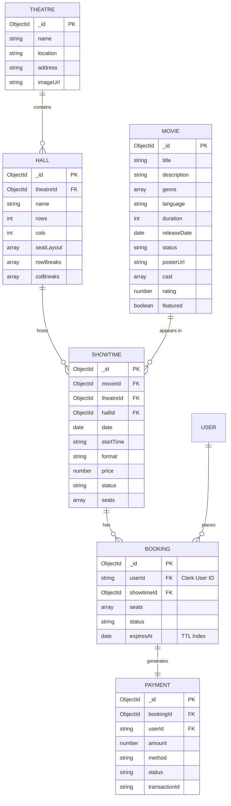

# Database Schema

CinePal uses MongoDB with Mongoose for data modeling. The relationships are primarily defined through ObjectIDs and population logic.

## Entity Relationship Diagram (ERD)

## Schema Details

### Theatre & Hall
- A **Theatre** can have multiple **Halls**.
- **Halls** define the physical grid (rows/cols) and the **seatLayout** (Regular vs. Premium).

### Movie & Showtime
- A **Movie** is a static entity in the catalogue.
- A **Showtime** links a **Movie**, **Theatre**, and **Hall** at a specific time.
- The **Showtime** document stores a snapshot of seat availability (status: available, hold, booked) specifically for that instance.

### Booking & Payment
- A **Booking** starts as `pending` with an `expiresAt` timestamp (usually 10 minutes from creation).
- MongoDB's TTL index automatically deletes `pending` bookings if they expire.
- A successful **Payment** transitions the **Booking** to `confirmed` and marks the corresponding seats in the **Showtime** as `booked`.
- **Payment** records are kept for financial auditing and refund processing.
